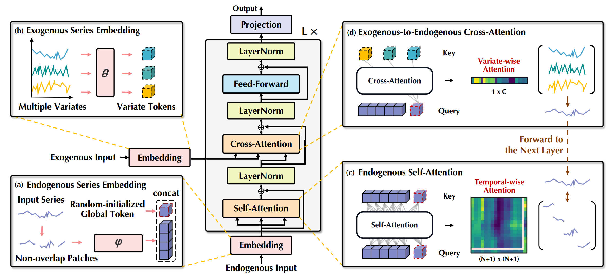
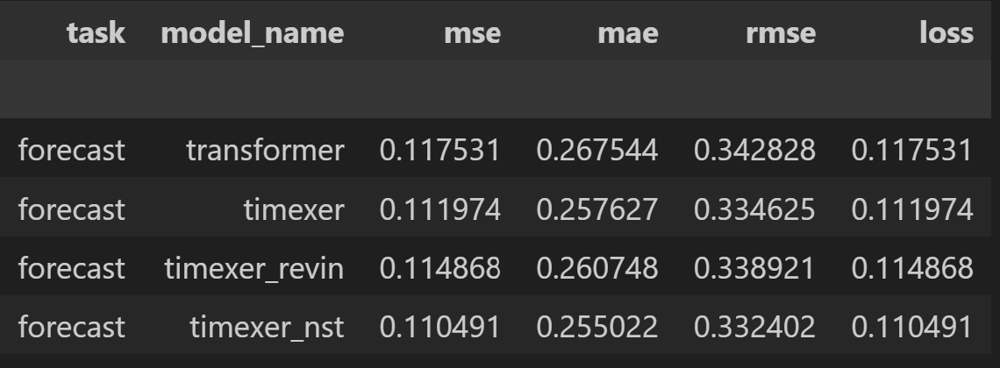
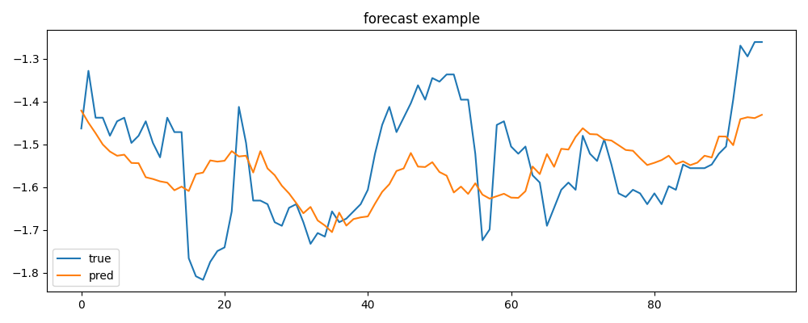
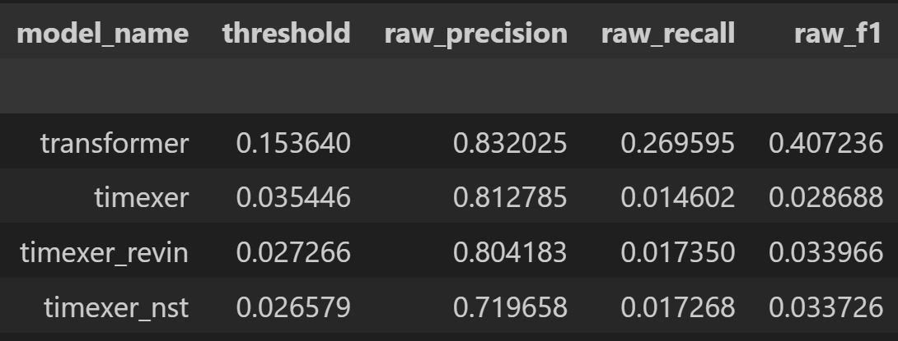
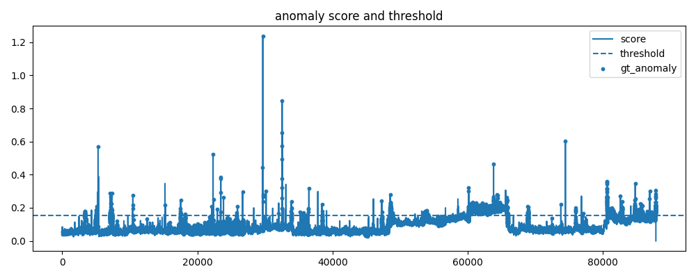
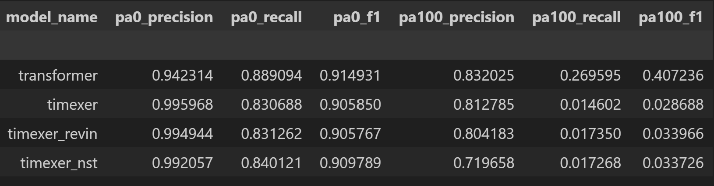
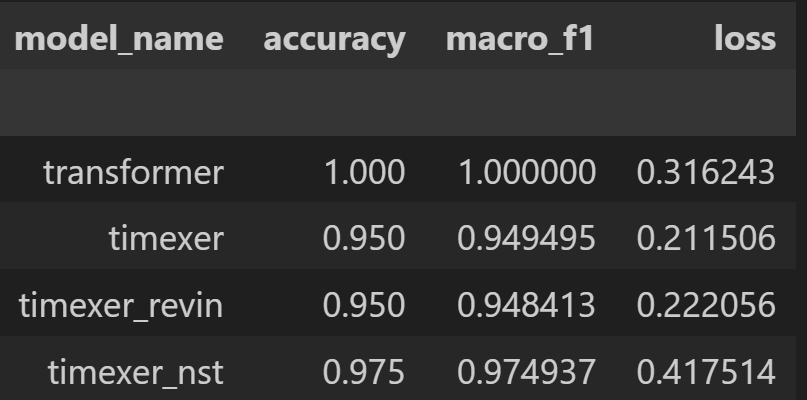
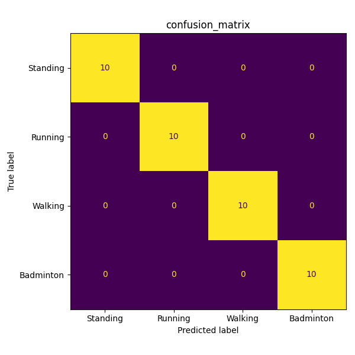
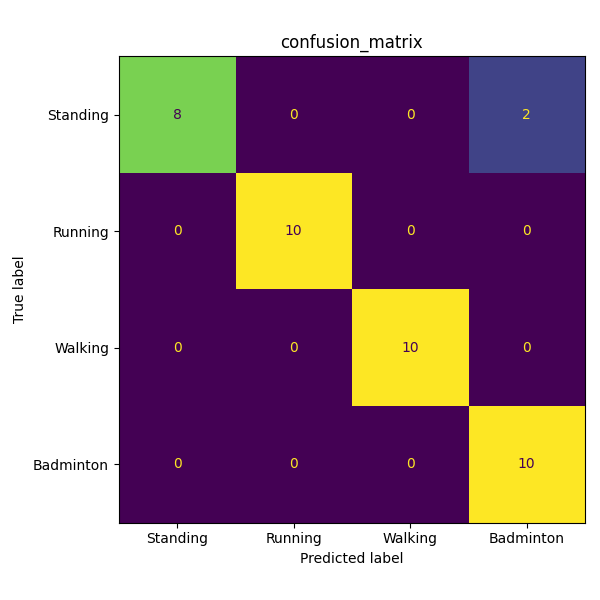

# 시계열 분석 프레임워크 (DSBA 연구실 코딩 테스트)

### 개요
벤치마크 데이터셋을 활용한 세 가지 시계열 분석 과업 통합 프레임워크

- 예측(forecasting): ETTh1
- 이상치 탐지(anomaly detection): PSM
- 분류(classification): UEA BasicMotions

딥러닝 모델을 활용한 시계열 분석 시 성능 저하의 주요 원인인 비정상성(non-stationarity)을 중심으로 시계열 분석 (비정상성: 시계열 데이터의 통계적 특성(평균, 분산 등)이 시간에 따라 변하는 성질)

### 활용 모델
- Transformer (encoder-only)
- TimeXer (encoder-style)
- TimeXer + RevIN
- TimeXer + Non-Stationary Transformer (NST)

### TimeXer 개요


- TimeXer는 PatchTST와 iTransformer를 결합한 모델

- TimeXer는 시계열 변수를 내생변수(endogenous variable)과 외생변수(exogenous variable)로 분리
- 내생변수: 모델 입력이자 출력이 되는 변수
- 외생변수: 모델 입력이지만 출력은 아닌 보조 변수

- TimeXer는 시계열 예측 모델이지만 비교의 일관성을 위해 세 가지 과업 모두에 적용 (Backbone과 task-specific head 분리)

- 표준 TimeXer는 CLS toknen 역할을 수행하는 하는 global token을 1개만 사용하도록 설계되었지만 복수 개를 사용할 수 있도록 모델 코드를 수정

### References
- Vaswani, A., Shazeer, N., Parmar, N., Uszkoreit, J., Jones, L., Gomez, A. N., & Polosukhin, I. (2017). Attention is all you need. Advances in neural information processing systems, 30.
- Wang, Y., Wu, H., Dong, J., Qin, G., Zhang, H., Liu, Y., & Long, M. (2024). TimeXer: Empowering transformers for time series forecasting with exogenous variables. Advances in Neural Information Processing Systems, 37, 469-498.
- Kim, T., Kim, J., Tae, Y., Park, C., Choi, J. H., & Choo, J. (2021). Reversible instance normalization for accurate time-series forecasting against distribution shift. In International conference on learning representations.
- Liu, Y., Wu, H., Wang, J., & Long, M. (2022). Non-stationary transformers: Exploring the stationarity in time series forecasting. Advances in neural information processing systems, 35, 9881-9893.

### Repo 구성

```text
.
├── README.md
├── requirements.txt
├── data/
│   ├── ETTh1.csv
│   ├── PSM/
│   │   ├── train.csv
│   │   ├── test.csv
│   │   └── test_label.csv
│   └── BasicMotions/
│       ├── BasicMotions_TRAIN.ts
│       └── BasicMotions_TEST.ts
├── notebooks/
├── scripts/
│   ├── analyze_dataset.py
│   ├── compare_results.py
│   ├── run_benchmark_suite.py
│   └── run_task.py
├── src/
│   ├── configs/
│   ├── data/
│   ├── metrics/
│   ├── models/
│   ├── trainers/
│   └── utils/
└── results/
```

### config 파일 목록

예측 (Forecasting):

- `src/configs/forecast_transformer.yaml`
- `src/configs/forecast_timexer.yaml`
- `src/configs/forecast_timexer_revin.yaml`
- `src/configs/forecast_timexer_nst.yaml`

이상치 탐지 (Anomaly detection):

- `src/configs/anomaly_transformer.yaml`
- `src/configs/anomaly_timexer.yaml`
- `src/configs/anomaly_timexer_revin.yaml`
- `src/configs/anomaly_timexer_nst.yaml`

분류 (Classification):

- `src/configs/classification_transformer.yaml`
- `src/configs/classification_timexer.yaml`
- `src/configs/classification_timexer_revin.yaml`
- `src/configs/classification_timexer_nst.yaml`


## 시계열 데이터 Exploratory Data Analysis (EDA)
### 요약 통계량
- [readme_1_statistics.ipynb](notebooks/readme_1_statistics.ipynb)

### 정상성 검정: Augmented Dickey–Fuller (ADF) test
- [readme_2_ADF.ipynb](notebooks/readme_2_ADF.ipynb)


## 전처리 
- 기존 코드를 TimeXer에 적합하게 변형

### 과업별 정규화 방법
- 예측 및 분류: standard scaling (z-score 정규화)
- 이상치 탐지:
- (1) 결측치 대체 (forward fill -> backward fill -> median)
- (2) robust scaling (전체 평균 및 표준편차 대신 quantile 모수 사용)


### 통일된 batch dictionary

```python
{
    "x": ...,          # 모델 입력 [L, C_total]
    "y": ...,          # 과업별 target 
    "endo_x": ...,     # 내생변수 입력 [L, N_endo]
    "exo_x": ...,      # 외생변수 입력 [L, N_exo]
    "endo_mask": ...,  # 내생변수 유효성 마스크 [L, N_endo]
    "exo_mask": ...,   # 외생변수 유효성 마스크 [L, N_exo]
}
```

- L: 시계열 길이
- C_total: 채널 개수 (feature 개수)
- N_endo: 내생변수 개수
- N_exo: 외생변수 개수


## 모델
### 텐서 차원 변환
#### Transformer encoder

Input batch:

- `x`: `[B, L, C]`

Shared encoder:

- input projection: `[B, L, C] -> [B, L, d_model]`
- encoder output: `[B, L, d_model]`

Task heads:

- forecasting: `[B, L, d_model] -> [B, pred_len, c_out]`
- anomaly: `[B, L, d_model] -> [B, L, c_out]` 
- classification: `[B, L, d_model] -> [B, num_classes]`

#### TimeXer models

Unified batch input:

- `endo_x`: `[B, L, N_endo]`
- `exo_x`: `[B, L, N_exo]`

Internal conversions:

- endogenous transpose: `[B, L, N_endo] -> [B, N_endo, L]`
- endogenous patchification: `[B, N_endo, L] -> [B*N_endo, P, patch_len]`
- patch embedding: `[B*N_endo, P, patch_len] -> [B*N_endo, P, d_model]`
- global token append: `[B*N_endo, P, d_model] -> [B*N_endo, P+G, d_model]`

- exogenous inverted embedding: `[B, L, N_exo] -> [B, N_exo, d_model]`
- expanded exogenous tokens: `[B, N_exo, d_model] -> [B*N_endo, N_exo, d_model]`

Encoder output:

- token tensor: `[B, N_endo, P+G, d_model]`
- patch tokens: `[B, N_endo, P, d_model]`
- global tokens: `[B, N_endo, G, d_model]`

Task heads:

- forecasting: `[B, N_endo, P+G, d_model] -> [B, pred_len, N_endo]`
- anomaly: `[B, N_endo, P, d_model] -> [B, L, N_endo]`
- classification: `[B, N_endo, G, d_model] -> [B, num_classes]`

### 분석 결과
- 하이퍼라미터 튜닝 없이 경량 모델 구현
- [readme_3_results.ipynb](notebooks/readme_3_results.ipynb)

#### 예측 결과 (ETTh1)
- TimeXer + Non-Stationary Transformer (NST) 성능 우위
- MSE 기준: TimeXer + NST > TimeXer > TimeXer + RevIN > Transformer



- TimeXer + NST


#### 이상치 탐지 결과 (PSM)
- Transformer encoder 성능 우위
- TimeXer 모델들은 reconstruction loss가 더 낮지만 이상치 탐지 성능 자체는 더 낮게 나타남




- Transformer


- PA%K (PA%K (Point-Adjustment with K% threshold))

```python

def apply_pa_k(pred: np.ndarray, gt: np.ndarray, k: int) -> np.ndarray:
    adjusted = pred.astype(int).copy()
    segments = find_segments(gt)
    for s, e in segments:
        seg = adjusted[s:e + 1]
        ratio = 100 * seg.sum() / max(1, len(seg))
        if ratio > k:
            adjusted[s:e + 1] = 1
    return adjusted

pred = (point_scores > threshold).astype(int)
pred = apply_pa_k(pred, point_labels, 0)

```
- K에 따른 모델별 성능: K = 0에서 네 모델의 성능이 유사하지만 K = 100에서 Transformer가 우위



#### 분류 결과 (UEA)
- Transformer 성능 우위




- Transformer


- TimeXer


## 분석 결과 요약 및 시사점
- 시계열 예측에서는 TimeXer 모델이 Transformer 모델보다 우위
- 하지만, 이상치 탐지 및 분류에서는 Transformer 우위
- 특히, 이상치 탐지에서 TimeXer의 reconstruction loss가 더 낮지만 이상치 탐지 성능은 떨어짐
- 대응 방법: threshold_quantile (0.995) 조정 e.g. 0.95
- 향후 연구: TimeXer 모델을 이상치 탐지 및 분류 등 범용 시계열 모델링 목적으로 확장